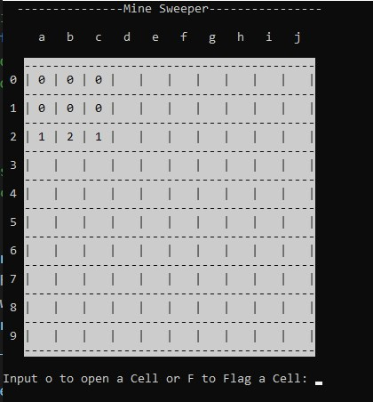

# MineSweeper
 
 
 
 A Console Based MineSweeper Game in C++
 I Developed this Game during my Introduction to Computing course.
 The Standard followed is C++11.
 The Board consists of 10 x 10 Square Grid
 
 **How To Play**
 Each row is numbered from 0 to 9
 Each column has a alphabet associated with it for a to j
 1. First you choose whether you want to OPEN a cell or FLAG a Cell.
 2. Second you enter the row number
 3. Third you enter the column alphabet 
 4. If you have chosen flag the corresponding cell will be flagged (as F will appear in it).
 5. If open was chosen then that cell be open to see if it had a bomb or not.
 6. If you encounter a bomb you lose!
 7. If all the non bomb cells are opended you win! 
